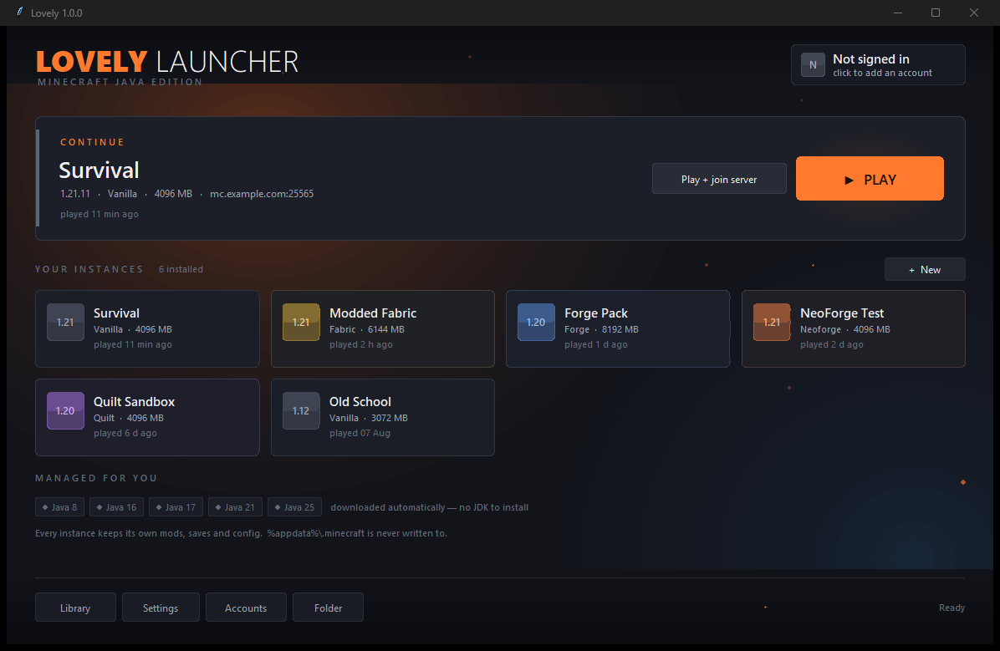

# Lovely

A desktop launcher for Minecraft: Java Edition. Every version installs into its own
folder, so mod loaders and mod sets can never contaminate one another.

Written for personal use by one developer. Windows, Python 3.10+, standard library only —
no dependencies to install.

## Why it exists

Running Fabric with one mod set and Forge with another means two installs fighting over a
single `mods` folder. The usual result is that both break, and neither error message
mentions the other install.

Lovely makes that structurally impossible. Each instance owns its own `mods`, `saves`,
`config`, `options.txt` and `servers.dat`, and the launcher refuses outright to use the
default game directory — a guard that runs on every launch, not just at creation.

Things that are safe to share are shared: assets, libraries, version metadata and Java
runtimes are addressed by content hash or by an immutable version id, so ten instances
point at one copy rather than ten.

## What it does

- Installs any version from the official manifest — releases, snapshots, betas, alphas
- Installs Fabric, Quilt, Forge and NeoForge
- Downloads and manages its own Java runtimes (8 / 17 / 21 / 25) per version, so there is
  no JDK to install by hand and no wrong-Java crashes
- Verifies every download against its published SHA-1 before using it
- Quick Play — launch straight into a server
- Per-instance memory, Java override, window size and JVM arguments
- Live log console, and instance export/import

## Sign-in

Sign-in uses Microsoft's standard OAuth 2.0 **device code flow**, followed by Xbox Live,
XSTS and `login_with_xbox`. The launcher then checks `/entitlements/mcstore` and
`/minecraft/profile`, and refuses to launch if the account does not own the game.

It does not bypass or weaken any security, authentication or licence check. There is no
offline, cracked or session-spoofing mode for online play. The launcher never handles a
password — credentials are entered only on Microsoft's own sign-in page. The long-lived
refresh token is stored with Windows DPAPI scoped to the current user; access tokens are
never written to disk and are redacted at the logging layer. No telemetry of any kind is
collected.

A development-only offline profile exists behind a command-line flag. It was used solely
to test the download and launch pipeline against a local server run with
`online-mode=false` while API access was pending. It produces no session token and cannot
authenticate to any online-mode server.

## Status

Working. Online sign-in is pending Microsoft's AppID review.

---

Not affiliated with, endorsed by, or associated with Mojang or Microsoft.
